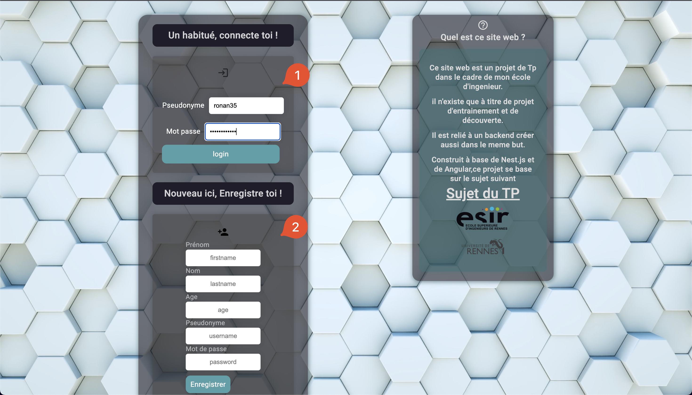
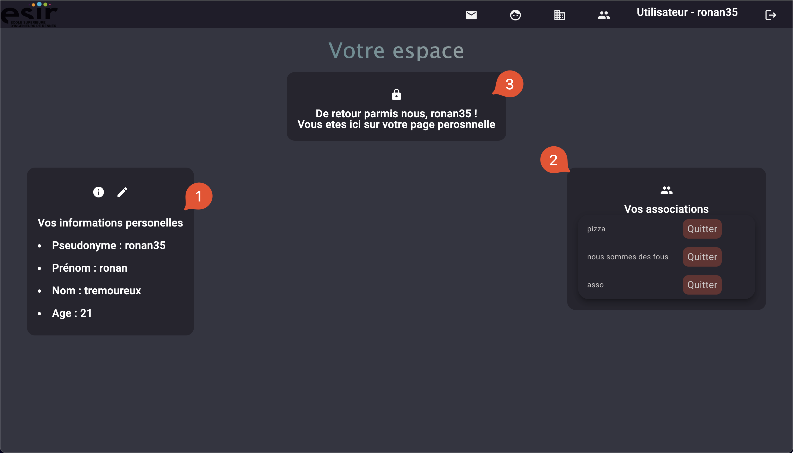
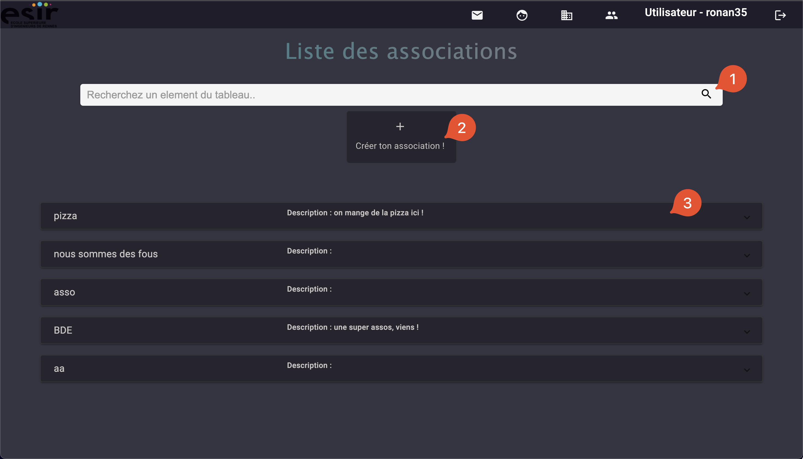
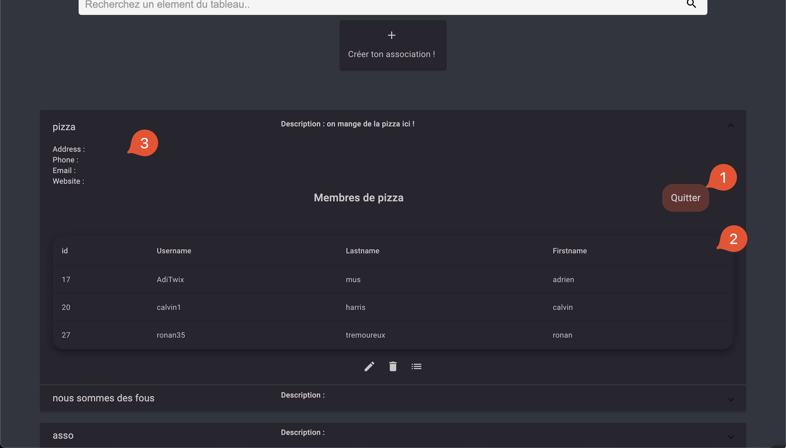
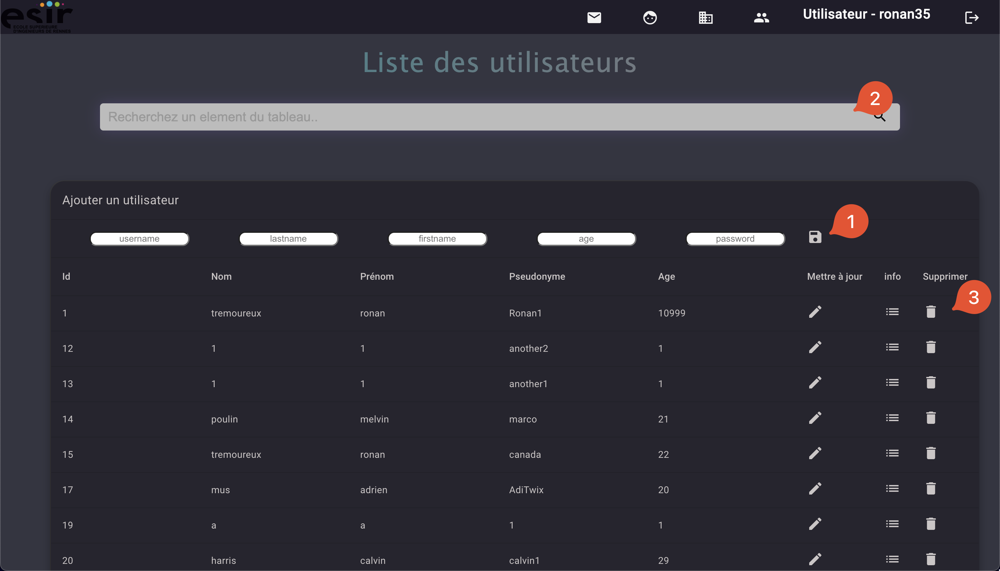

# Rendu Front

Ce document témoigne des ajouts au sujet initial, et des choix de design pour la partie front du projet de web.

## Ajouts au sujet

- Pour se connecte, vous devez renseigner un pseudonyme et non un id. Vous devez donc renseigner un pseudonyme quand vous vous enregistrez.

- Vous pouvez vous désabonner des associations sur votre page d'accueil.

- L'utilisateur connecté est affiché en permanance dans la barre de navigation.

## Choix de modélisation

Choix d'utilisation d'un composant spécifique pour :

- Une barre de recherche sous forme de composant, utilisable sur plusieurs pages.
  Cela permet d'éviter la duplication de code, et de pouvoir modifier l'apparance du site rapidement.
  Elle permet de trier les éléments en fonctions de leurs attributs.
  Elle fait une requette au backend contenant un string.
  Chaque element ayant un attribut commencant par ce string, est renvoyé au front-End.
  ils sont ainsis affichés dans la table

- Une barre de navigation superieur.
  Pour les memes raisons que la barre de recherche, cela simplifie la modification. Etant donné que cet élément est identique pour chaques pages, cela etait une bonne solution

- Choix d'utiliser des Popups, pour modifier un utilisateur, visualiser en détail les informations d'un utilisateur, ou encore certaines popups permettent de créer et modifier les associations.

- Certaines variables scss ont été ajoutées pour les couleurs principales du site, afin de pouvoir etre changés facilement.
  

## Choix de design

Les éléments présents dans le site web sont reactifs.

Cela permet la visibilitée des actions possible sur le site et facilite les interractions.

# Pages du site

## Page Login

- 1 ) La page de login permet de se connecter grace à son    pseudonyme sur le service.

- 2 ) Ele permet également de créer un compte si vous n'en avez pas.

## Page principale

La page principale est la premiere page qui apparait apres la connection . 

- 1 ) Elle contient vos donnés qui sont éditables

- 2 ) Vous pouvez visualiser et quitter les associations que vous avez rejoint.

- 3 ) Un message d'accueil y est affiché

## Liste d'associations

- 1 ) Une barre de recherche permettant de rechercher nimporte quelle information, et trie en directe la liste.

- 2 ) Un bouton ouvrant une popup sur un formulaire de création d'associations

> - 3 ) les volets ouvrables, depuis lesquels vous pourrez voir les membres (2), les informations (3), et meme quitter ou rejoindre l'association ! (1)

## Liste d'utilisateurs 

- 1 ) La création d'utilisateur se fait dans le header de la table, ssauvegarder cet utilisateur grace au bonton "save"

- 2 ) Une barre de recherche permettant de rechercher nimporte quelle information, et trie en directe la liste.

- 3 ) Les boutons vous permettent d'effectuer les actions sur les utilisateurs